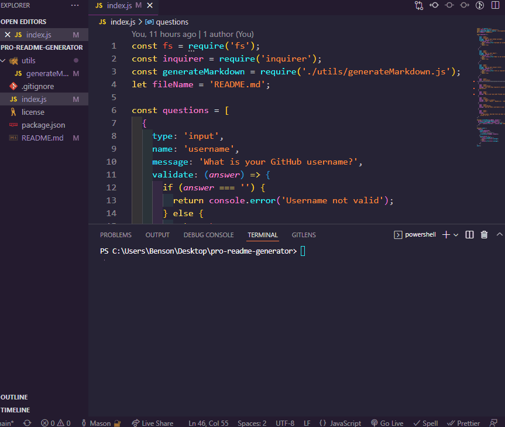

# Pro README.md Generator

## Table of Contents

- [Description](#description)
- [Installation](#installation)
- [Usage](#usage)
- [License](#license)
- [Questions](#questions)

## Description

This application prompts the user with a series of questions in order to generate a professional README.md file for their projects.

[Full Video Demo](https://drive.google.com/file/d/1GIywV49-sWP_ir0oDt-CNhPRw9tTG9KB/view)

## Installation

Clone Github repo to device. Install node.js and download the inquirer package dependency.

## Usage

Open node and run index.js. Questions will display in your terminal that you can answer to build your readme file.

## License

MIT License

Copyright (c) 2022 Mason Benson

Licensed under the [MIT](LICENSE) license.

## Questions

Contact me here:

- [GitHub Profile](https://github.com/mbenson025)
- Email me at mbenson025@gmail.com
